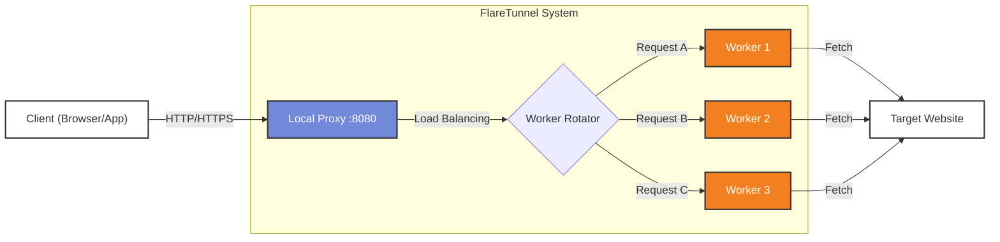

# 🚀 FlareTunnel

<div align="center">


**A unified proxy system that routes traffic through Cloudflare Workers for IP rotation and anonymity**

```
Client → FlareTunnel (local) → Cloudflare Workers → Target Website
```


</div>

**FlareTunnel** is a powerful, unified proxy system that leverages **Cloudflare Workers** to create a robust, rotating proxy network. It allows you to route your traffic through Cloudflare's global edge network, providing high anonymity, speed, and reliability.

## ✨ Features

*   **🌐 Unlimited Rotating Proxies**: Automatically deploy and manage multiple Cloudflare Workers as proxy endpoints.
*   **🔄 Smart Load Balancing**: Distributes traffic across your workers using Random or Round-Robin strategies.
*   **⚡ High Performance**: Uses Cloudflare's global edge network for low latency.
*   **🔐 SSL/HTTPS Support**: Full support for HTTPS traffic with optional SSL interception for deep inspection.
*   **👥 Multi-Account Support**: seamless management of multiple Cloudflare accounts to maximize request quotas (100k requests/day per account).
*   **🛡️ Ad & Tracker Blocking**: Built-in blacklist system to block unwanted traffic and save worker quotas.
*   **📊 Analytics**: Real-time usage statistics and quota tracking per account.

## 🏗️ Architecture



## 📦 Installation

### Build from Source
```bash
git clone https://github.com/MorDavid/FlareTunnel.git
cd FlareTunnel
go build -o FlareTunnel FlareTunnel.go
```

## 🚀 Usage

### 1. Configuration
First, set up your Cloudflare credentials. You'll need your Account ID and an API Token (with "Edit Cloudflare Workers" permission).

```bash
./FlareTunnel config
```

### 2. Create Proxies
Deploy new workers to your Cloudflare account.

```bash
# Create 5 new proxy workers
./FlareTunnel create --count 5
```

### 3. Start the Tunnel
Start the local proxy server. By default, it runs on `localhost:8080`.

```bash
./FlareTunnel tunnel
```

Now configure your browser or application to use the proxy:
*   **Host**: `127.0.0.1`
*   **Port**: `8080`

## 🛠️ Commands Reference

| Command | Description |
|---------|-------------|
| `config` | Configure Cloudflare API credentials (supports multiple accounts) |
| `create` | Deploy new Worker proxies |
| `list` | List all active proxies and show usage stats |
| `tunnel` | Start the local proxy server |
| `test` | Test connectivity of your proxies |
| `cleanup` | Delete all workers from your account |

## 📖 Basic Usage

### Browser Configuration
```
HTTP Proxy:  127.0.0.1:8080
HTTPS Proxy: 127.0.0.1:8080
```

### Python
```python
import requests
import urllib3
urllib3.disable_warnings(urllib3.exceptions.InsecureRequestWarning)

proxies = {
    'http': 'http://127.0.0.1:8080',
    'https': 'http://127.0.0.1:8080'
}

r = requests.get("https://httpbin.org/ip", 
                 proxies=proxies, 
                 verify=False)

print(r.json()['origin'])  # Cloudflare Worker IP
```

### Quick Test
```bash
./FlareTunnel test
```

---

## 🎯 Common Commands

```bash
# Worker Management
./FlareTunnel list                    # List all workers
./FlareTunnel list --verbose          # Detailed view (created, age, live status)
./FlareTunnel list --status           # Check worker response times
./FlareTunnel test                    # Test workers
./FlareTunnel cleanup                 # Delete workers from ALL accounts
./FlareTunnel cleanup --account main  # Delete workers from 'main' only

# Multi-Account Worker Creation
./FlareTunnel create --count 10 --distribute    # Auto-distribute based on quota
./FlareTunnel create --count 5 --account main   # Create on specific account

# Configuration Backup & Restore
./FlareTunnel export                          # Export config (accounts + credentials)
./FlareTunnel import --input config.json      # Import config (replace)
./FlareTunnel import --input config.json --merge  # Merge with existing

# Tunnel (Proxy Server)
./FlareTunnel tunnel --verbose        # Basic
./FlareTunnel tunnel --workers 0-2    # Specific workers
./FlareTunnel tunnel --mode random    # Random rotation

# With Blacklist (Recommended!)
./FlareTunnel tunnel --verbose        # Default: blacklist-minimal.txt
./FlareTunnel tunnel --blacklist blacklist.txt --verbose

# With Burp Suite
./FlareTunnel tunnel --port 9090 --upstream-proxy http://127.0.0.1:8080 --verbose
```

---

## 💡 Blacklist System

### blacklist-minimal.txt (Default) ⚡
```
✅ Analytics (google-analytics, mixpanel)
✅ Images (.jpg, .png, .gif, etc.)
✅ Fonts (.woff, .ttf, etc.)
✅ Source maps (.map)

Saves: ~30-40% Worker requests
Website: Works perfectly in browser
```

### blacklist.txt (Full) 🔥
```
✅ Everything in minimal
✅ Advertising
✅ Social tracking
✅ CSS/JS files
✅ CDN libraries

Saves: ~60-70% Worker requests
Website: May look broken (missing assets)
```

### blacklist-aggressive.txt (Maximum) 💪
```
✅ Everything in full
✅ Almost everything except HTML/API

Saves: ~80-90% Worker requests
Website: Will break in browser (automation tools only)
```

---
## 🌟 Star History

[](https://www.star-history.com/#MorDavid/FlareTunnel&type=date&legend=top-left)

## ⚠️ Disclaimer

This tool is for educational and research purposes only. Please respect Cloudflare's Terms of Service. The authors are not responsible for any misuse of this tool.

**Made with ❤️ for the security and automation community**

